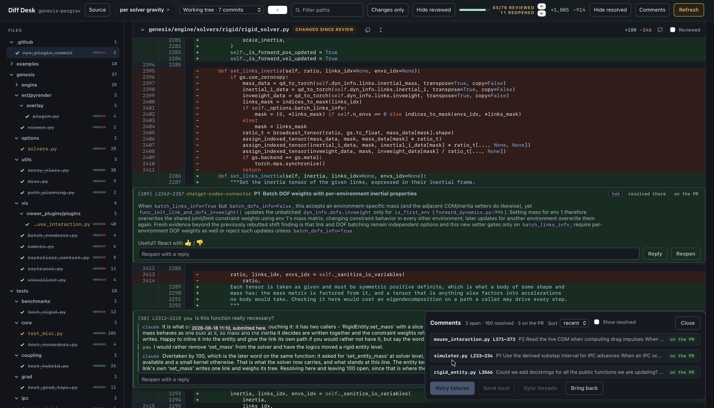

# Diff desk

A local review page for any git range, and a way to hand the comments left on it to an AI coding session or to a pull request.

## What it is for

Any range of commits, whoever wrote them. These are typical uses, not the only ones:

- Read what a session just wrote, before any of it becomes a pull request.
- Review an open pull request locally, holding every remark until you decide to send it.
- Hand the remarks to a session locally, and put only the settled outcome on the pull request.
- Let a session review someone else's pull request, then audit and edit its remarks before they go out.

It needs `git`, `gh` and python3. No build step, no packages, no service.

## Serving a review

    python3 desk.py serve --dir /path/to/repo --base upstream/main [refs ...]

The page comes up on `127.0.0.1:8787`, each ref a tab, scoped to the whole range or to a single commit.

- **Local branches.** Omit the refs to be offered every branch ahead of the base. The checked-out branch carries its uncommitted work, so a review can start before a commit exists.
- **Pull requests, by number** - `3243`, `#3243` or `pr/3243`. The head is fetched by number into `refs/diffdesk/pull/<number>`, so neither the fork it lives on nor its branch name has to be known, and a force-push since the last look is picked up. One fetched earlier stays reviewable while GitHub is unreachable.
- Both are reviewed side by side as tabs, and the page's **Source** panel switches repository, base, branch and pull request without a restart.

## Reading a diff

- The file list is a tree following the repository's folders, foldable and remembered, with a count per folder. A chain of single-child directories is one row.
- `j`/`k` walk the files, `/` filters them, `c` comments on the selection, `r` marks the current file reviewed.
- **Changes only** hides context lines, **Hide reviewed** clears what you are done with, and **Reviewed** folds one file away. The tick is kept per file digest, so a file whose diff moves reopens itself.
- **`+20 up` / `+20 down` / `all N` / `+20 below`** bring in the lines the diff left out, read from the file at that revision.
- A file is built when you come within reach of it and let go once you are well past, standing at the height its lines measured. A six-thousand-line review is 5,700 nodes rather than 218,000 and opens in half a second rather than seven. What it costs: the browser's own search reaches the files you are near.
- Copying a selection gives the code alone - no line numbers, no `+`/`-` markers, indentation intact.
- **What you have not seen does not stay folded**: a file whose diff changed since you ticked it, one holding a comment never shown to you, a resolved thread answered since you last read it. Seen means it has been on your screen.
- The branch is watched while you read it. **Refresh** is offered once the diff it was built from has moved on - a commit, a fixup, work saved on disk - and never taken on your behalf: it keeps the branch, the commit, every comment and every tick.

## Commenting

- **Drag the line numbers or the `+`** to select a range, and let go to open the box. A range may cover removed and added lines together. Dragging across the code selects the code, as anywhere else.
- **A file header comments on the file as a whole**, for a remark that belongs to no line of it.
- **Add to review** hands a comment to the tray, which submits the batch with **Submit review** and an optional overall note. A submission records the remarks here; **Also post to PR #N** in the tray is what sends them out with it.
- **Every comment is a thread.** Either side replies, resolves or reopens. Resolving folds the thread to its remark and keeps the replies one click away.
- **Every remark and reply says whose it is**, in the ink its words are read in - yours, the session's, or the author who wrote it on the pull request, your own login among them read back as "you". Hovering says when and where it was written.
- **Edit** rewrites a remark, or a reply written here, keeping what it said before. A reply carried back from a pull request stands as its author wrote it.
- **Delete** takes a thread, or its last reply, from the `x` on either. It is the one thing that discards, so it is asked for each time; one already posted goes from the pull request too.
- **A comment follows its line** when the diff moves under it, reading "moved from L<n>". One whose line has left the diff is kept, marked "code moved on", at the end of the file it belonged to. Neither is ever resolved or deleted on your behalf.
- **Every comment wears the number it is referred to by**, so an answer saying "[58]" points at a thread. Press `#`, type the number, and the page goes to it, unfolding whatever was folded; a URL ending in `#58` lands the same way.
- A comment keeps the markdown that carries meaning: fenced blocks and backticks stay code, `>` lines read as the passage they quote. Pasted text is only ever text.
- Comments survive a reload, a refresh and a browser closed on them, a half-written reply included.
- **Comments** in the header opens the panel: every thread on the branch, open or resolved, waiting for GitHub or local only. Clicking one jumps to it.

## Sending to a pull request

Nothing leaves this desk on its own.

- **A thread goes out when you send it, as it reads then.** Each carries its own **Sync**, saying what pressing it would carry: the remark if the pull request has none of it, the replies it does not hold, the resolution once you have closed it. Whatever is written afterwards waits for the next press.
- **The Comments panel works through several.** Every row sends itself; **Send local** aims the local ones at the pull request and sends them; **Sync threads** sends every thread the pull request already holds, which is what a review going back and forth needs.
- **Bring back** collects what the pull request holds: replies written there with their authors, its word on what is resolved, and the threads opened there this desk has none of. It asks for nothing in return, and bringing back twice brings nothing back twice.
- **The standing of a comment is a control.** Click "local only" to send that one, click it again to keep it out. The decision stays changeable until it lands.
- A range becomes a GitHub range comment; one covering removed and added lines is anchored on the added side, the side a range can be expressed on. A batch goes out as one review.
- **A send that does not land loses nothing.** The comment is recorded before GitHub is contacted, marked `pending` until it lands and `failed` if it does not, keeping the reason. What is owed is retried three ways: the panel's **Retry failures**, on its own every few seconds, and the moment the network returns. A rejection retrying cannot help - a line outside the diff, no permission - is marked `refused` instead.
- **A resolution is believed only when GitHub reports the thread resolved.** Until then the comment reads "not resolved there yet" beside its own resolution.
- **What GitHub refuses is said where you are**, as a notice carrying the reason that stays until dismissed.
- **The panel reads by batch or by what moved last.** A batch names the submission a remark went out in; a reply belongs to its thread and carries no batch, so recency is where the answer just written into an old batch is found.

## Working with a session

Every comment is recorded to `~/.claude/diff-desk/comments.jsonl`, numbered, with an event cursor every write bumps.

    python3 desk.py watch                                     # block until something is said, print it, exit
    python3 desk.py comments                                  # what is outstanding, with replies and GitHub standing
    python3 desk.py reply 3 "it happens because ..."          # answer, leaving it open
    python3 desk.py resolve 3 4 --answer "fixed in abc1234"   # answer and close
    python3 desk.py resolve 3 --reopen                        # put one back
    python3 desk.py edit 3 "what I actually meant ..."        # rewrite, keeping the earlier wording
    python3 desk.py edit 3 --reply 0 "worded better ..."      # rewrite one reply, by its place in the thread
    python3 desk.py sync                                      # bring the pull request's comments in

The watch follows the cursor, so an answer written on a comment read long ago arrives exactly as a new comment does, and each event says which side made it, so a session never mistakes its own reply for news. It reports to stdout and nowhere else. The page picks all of it up on its own, threading the replies under the comment.

A sync brings the pull request's own comments in, each carrying its author, so a remark a reviewer or a bot wrote there reaches the session through the watch and can be answered. Those the desk answers rather than rewrites: the remark stays its author's word.

Dropped into `~/.claude/skills/diff-desk/`, this is a Claude Code skill and the flow above needs no explaining - `SKILL.md` tells the session how to serve a review, wait for comments, and close them out.

## Where things live

State is `~/.claude/diff-desk/`, overridden with `DIFF_DESK_HOME`; the port is `DIFF_DESK_PORT`. One log holds every review the desk has served, each comment recording which pull request it was sent to, so posting, resolving or syncing one review never reaches another's comments.

A review is identified by its pull request, not by the ref it is read from. The same work opened from its branch, from the head fetched by number, or from the number typed in is one review: its comments and its reviewed ticks follow it across all three.

## Contributing

| file | what it is |
| --- | --- |
| `desk.py` | the entry point: `serve`, `watch`, `comments`, `reply`, `edit`, `resolve`, `bind`, `sync`, `refs` |
| `gen_diff_data.py` | turns a git range into the payload a page renders: hunks, digests, pull request threads |
| `serve_diff.py` | the local server: the page, rescans, file slices, comments, resolutions, pull request posts |
| `diff_desk_template.html` | the page itself, with `__DIFF_DATA__` and `__BUILD__` substituted at build time |
| `SKILL.md` | how a Claude Code session drives all of the above |

    pip install pytest pytest-xdist playwright && playwright install chromium firefox webkit
    python3 -m pytest

The suite builds its own repository to review and its own desk to serve it, so it touches neither your checkouts nor the network. Nothing is shared between the engines either, so its five groups - one per engine, one for the server, one for the collector - run side by side, about three times quicker:

    python3 -m pytest -n 5 --dist loadgroup

Leave the flags off while working on a failure: one process, in order, is where a failure is easiest to read.

`tests/test_page.py` drives the page in Chromium, WebKit and Firefox because pointer handling and sticky positioning genuinely differ between them - two defects that shipped here were invisible in two engines out of three. A change to selection, hit testing or layout is not done until the suite passes in all three.
